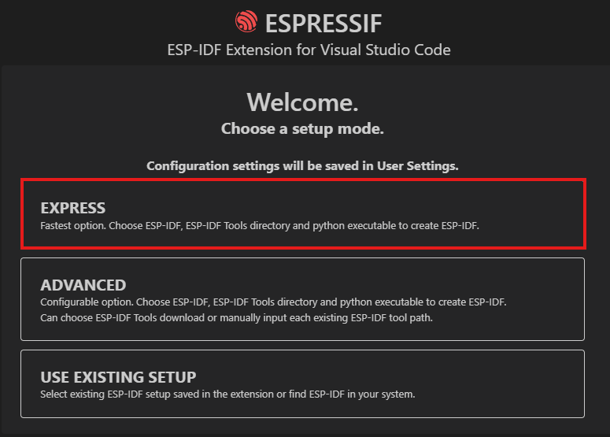
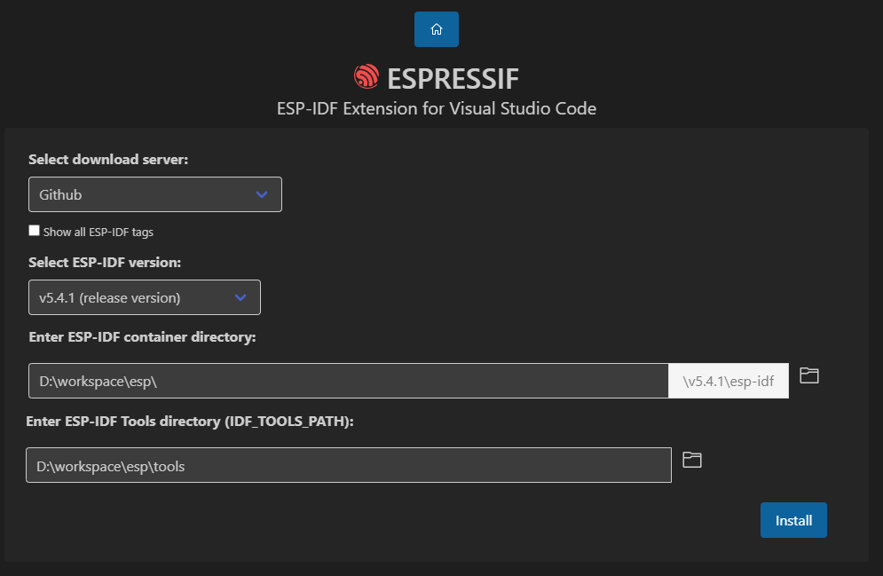

# Extendable AIOT 環境安裝教學

## 前置條件

- VSCode

## 安裝

1. 安裝[ESP-IDF](https://marketplace.visualstudio.com/items/?itemName=espressif.esp-idf-extension)
2. 安裝完成後先進入hardware/extendable_aiot資料夾(用open-folder)
3. 進入後用```Ctrl+Shift+P```輸入```ESP-IDF:Configire ESP-IDF Extension```
4. 進入頁面後選擇```EXPRESS(標準安裝)```
5. 選擇v5.4.1然後自己選一個位置放要下載的地方(tools跟idf都放一起)
6. 等它下載&安裝好
7. 調整下方工具列
    1. 資料夾圖示，選擇extendable_aiot
    2. 星星是燒錄方式，選擇UART
    3. COM5 那個每次都不一樣，是你插USB的port
    4. 芯片圖案(esp32):目標機型，選擇esp32
    5. 火焰圖案是構建專案+上傳+燒錄(直接快速燒錄的要再找一下)
8. 等待燒錄完成
9. 看燈有沒有一閃一閃的
10. 有問題的話找阿昀OuOb
